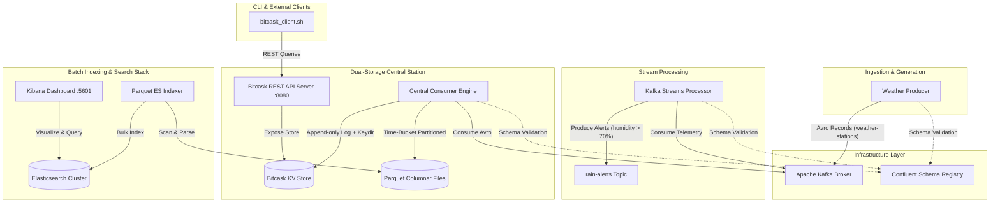

# 🌦️ WeatherStation Real-Time Data Pipeline & Storage Engine

[](https://openjdk.org/)
[](https://kafka.apache.org/)
[](https://kafka.apache.org/documentation/streams/)
[](https://www.elastic.co/elasticsearch/)
[](https://www.elastic.co/kibana)
[](https://www.docker.com/)
[](https://kubernetes.io/)

A high-performance, fault-tolerant, end-to-end data pipeline built for ingesting, streaming, storing, indexing, and visualizing distributed weather station telemetry data in real time.

The system combines **event-driven streaming** with a **dual-storage architecture**:
1. **Bitcask Key-Value Engine**: A custom log-structured key-value store optimized for high-throughput write workloads and low-latency O(1) point lookups with an HTTP REST API interface.
2. **Parquet Columnar Storage & Elastic Search Stack**: Time-partitioned columnar Parquet files automatically indexed into Elasticsearch and visualized in Kibana for large-scale analytics and aggregations.

---

## 📸 System Architecture



---

## 💡 Key Features & Highlights

- **Avro & Schema Registry Integration**: Enforces strict payload contracts across producers, streams, and consumers using `StatusMessage.avsc` managed by Confluent Schema Registry.
- **Real-Time Stream Analytics**: Detects high-humidity events (`> 70%`) instantly via Kafka Streams and publishes warnings to dedicated alert channels.
- **Custom Bitcask Key-Value Engine**:
  - **Log-Structured Storage**: Append-only segment file architecture with `DataEntry` CRC32 validation.
  - **In-Memory Index (Keydir)**: Lightning-fast O(1) lookup times pointing directly to offset positions.
  - **Background Compaction & Merge**: Reclaims disk space by compacting obsolete keys into new segment files.
  - **Hint Files**: Fast boot recovery index initialization without scanning raw data logs.
  - **HTTP REST Service**: Built-in HTTP API on port 8080 with endpoints for key lookups and full dataset export.
- **Columnar Analytics Sink**: Batches and writes telemetry records into snappy-compressed Apache Parquet format.
- **Automated Elasticsearch Indexing**: Dedicated file scanner service monitors Parquet storage, prevents duplicate processing via state tracking, and bulk-indexes telemetry into Elasticsearch.
- **Turnkey Containerization**: Out-of-the-box support for both single-command Docker Compose local development and full Kubernetes (Minikube) cluster orchestration.

---

## 🧩 Microservice Breakdown

| Module / Service | Language / Stack | Role & Responsibilities | Key Files / Path |
| :--- | :--- | :--- | :--- |
| **`shared_model`** | Java 21 / Avro | Defines the binary telemetry schema `StatusMessage.avsc` and shared application config properties. | [StatusMessage.avsc](file:///home/mariam/Documents/WeatherStation/shared_model/src/main/resources/avro/StatusMessage.avsc) |
| **`my_producer`** | Java 21 / Kafka Client | Simulates distributed weather stations generating telemetry data (station ID, sequence no, battery status, timestamp, humidity, temperature, wind speed). | [Producer.java](file:///home/mariam/Documents/WeatherStation/my_producer/src/main/java/com/weather/my_prod/Producer.java) |
| **`my_stream`** | Java 21 / Kafka Streams | Processes the telemetry stream in real time. Triggers rain warning alerts when humidity crosses configured threshold. | [WarningApp.java](file:///home/mariam/Documents/WeatherStation/my_stream/src/main/java/com/weather/my_stream/WarningApp.java) |
| **`base_central_station`** | Java 21 / Bitcask + Parquet | Core consumer service executing dual writes to custom Bitcask KV engine and Parquet file archiver. Hosts HTTP REST API on port 8080. | [BitCaskStore.java](file:///home/mariam/Documents/WeatherStation/base_central_station/src/main/java/com/weather/bitcask/engine/BitCaskStore.java) |
| **`parquet_es_indexer`** | Java 21 / ES Client | Scans generated Parquet output directory, parses columnar files, state-tracks indexed files, and pushes records to Elasticsearch. | [IndexerMain.java](file:///home/mariam/Documents/WeatherStation/parquet_es_indexer/src/main/java/com/weather/indexer/IndexerMain.java) |
| **`bitcask_client.sh`** | Bash / Curl | CLI utility for querying the Bitcask REST API. Supports single-key queries, full dumps, and multi-threaded stress testing. | [bitcask_client.sh](file:///home/mariam/Documents/WeatherStation/bitcask_client.sh) |
| **Elasticsearch & Kibana** | Elastic Stack 8.18 | Indexing, full-text search, aggregation, and real-time visualization dashboards. | [docker-compose.yml](file:///home/mariam/Documents/WeatherStation/docker-compose.yml) |

---

## 📜 Data Schema & Payload

Telemetry records follow the Avro schema contract defined in [`shared_model/src/main/resources/avro/StatusMessage.avsc`](file:///home/mariam/Documents/WeatherStation/shared_model/src/main/resources/avro/StatusMessage.avsc):

```json
{
  "station_id": 104,
  "s_no": 4821,
  "battery_status": "medium",
  "status_timestamp": 1721643065,
  "weather": {
    "humidity": 82,
    "temperature": 24,
    "wind_speed": 15
  }
}
```

---

## 📋 Prerequisites & Requirements

Before deploying the WeatherStation pipeline, ensure your system has the following installed:

- **Java Development Kit (JDK 21)**
- **Apache Maven 3.8+**
- **Docker Desktop / Docker Engine (v24+) & Docker Compose**
- **Minikube & `kubectl`** *(Required for Kubernetes deployment)*
- **Resources**: Recommended minimum **8 GB RAM** and **4 CPU cores** for running the full stack (Kafka + Schema Registry + Elastic Stack + Microservices).

---

## ⚡ Quickstart & Deployment

You can launch the entire infrastructure and microservice pipeline using convenient shell scripts or standard deployment tools.

### Option 1: One-Click Shell Scripts (Recommended)

- **Local Docker Stack**:
  ```bash
  chmod +x start-docker.sh
  ./start-docker.sh
  ```
- **Kubernetes (Minikube) Stack**:
  ```bash
  chmod +x start-k8s.sh
  ./start-k8s.sh
  ```
- **Elasticsearch & Kibana Stack Only**:
  ```bash
  chmod +x start_search_stack.sh
  ./start_search_stack.sh
  ```

---

### Option 2: Docker Compose Deployment

1. **Build the Maven modules**:
   ```bash
   mvn clean package -Dmaven.test.skip=true
   ```

2. **Spin up all containers**:
   ```bash
   docker-compose up -d --build
   ```

3. **Monitor running services**:
   ```bash
   docker-compose ps
   ```

4. **View logs**:
   ```bash
   # Stream logs for all services
   docker-compose logs -f

   # View specific microservice logs
   docker-compose logs -f consumer
   docker-compose logs -f stream
   ```

5. **Teardown & volume cleanup**:
   ```bash
   docker-compose down -v
   ```

---

### Option 3: Kubernetes Deployment via Minikube

The repository includes a production-grade Kubernetes manifest suite inside the [`k8s/`](file:///home/mariam/Documents/WeatherStation/k8s) directory.

1. **Start Minikube with required resource limits**:
   ```bash
   minikube start --memory=8192 --cpus=4 --driver=docker
   ```

2. **Configure terminal shell to use Minikube's Docker daemon**:
   ```bash
   eval $(minikube docker-env)
   ```

3. **Build optimized application images directly inside Minikube**:
   ```bash
   docker build -f Dockerfile.producer.minimal -t weather-producer:latest .
   docker build -f Dockerfile.stream.minimal   -t weather-stream:latest .
   docker build -f Dockerfile.consumer.minimal  -t weather-consumer:latest .
   docker build -f DockerFile.indexer           -t weather-indexer:latest .
   ```

4. **Execute automated sequential deployment**:
   The [`k8s/deploy-all.sh`](file:///home/mariam/Documents/WeatherStation/k8s/deploy-all.sh) script handles creating PersistentVolumeClaims, ConfigMaps, health checking Kafka & Schema Registry, and spinning up all pods.
   ```bash
   chmod +x k8s/deploy-all.sh
   ./k8s/deploy-all.sh
   ```

5. **Verify Pod Status**:
   ```bash
   kubectl get pods -w
   ```

6. **Access Kibana Dashboard**:
   ```bash
   minikube service kibana --url
   ```

7. **Clean up Kubernetes resources**:
   ```bash
   kubectl delete -f k8s/
   ```

---

## 🛠️ Interacting with Bitcask Key-Value Store

The Central Station exposes a REST API interface backed by the custom Bitcask KV storage engine. You can query key-value state using HTTP endpoints or the provided [`bitcask_client.sh`](file:///home/mariam/Documents/WeatherStation/bitcask_client.sh) tool.

### REST API Endpoints

- **`GET /view-key?id={station_id}`**: Retrieves the latest status message for a specific station ID.
  ```bash
  curl -s "http://localhost:8080/view-key?id=101"
  ```
- **`GET /view-all`**: Dumps all key-value entries in CSV format (`key,value`).
  ```bash
  curl -s "http://localhost:8080/view-all"
  ```

### CLI Client Tool (`bitcask_client.sh`)

- **View a specific station key**:
  ```bash
  ./bitcask_client.sh -view-key 101
  ```

- **Export all entries to a timestamped CSV file**:
  ```bash
  ./bitcask_client.sh -view-all
  ```

- **Perform concurrent multi-thread load benchmark**:
  Fires `N` concurrent worker threads against the REST API to test parallel read performance:
  ```bash
  ./bitcask_client.sh -n=50
  ```

---

## 📊 Analytics with Elasticsearch & Kibana

1. Open Kibana in your browser at `http://localhost:5601` (or the URL provided by `minikube service kibana --url`).
2. Navigate to **Stack Management** > **Data Views** (or **Index Patterns**).
3. Create a data view with index pattern `weather-status*` and timestamp field `status_timestamp`.
4. Navigate to **Discover** or **Dashboards** to build visualizations:
   - **Temperature & Humidity Trends**: Line charts broken down by `station_id`.
   - **Rain Alerts Frequency**: Monitoring events published to the `rain-alerts` topic.
   - **Battery Status Distribution**: Pie chart aggregating `battery_status` ("low", "medium", "high").

---

## ⚙️ Configuration Matrix

Environment variables across Docker Compose and Kubernetes configurations:

| Variable | Default Value | Description |
| :--- | :--- | :--- |
| `KAFKA_BROKER` | `kafka:9092` | Kafka broker bootstrap server address. |
| `SCHEMA_REGISTRY_URL` | `http://schema-registry:8081` | Confluent Schema Registry endpoint. |
| `KAFKA_PRODUCER_TOPIC` | `weather-stations` | Topic name for raw telemetry events. |
| `KAFKA_WARNING_INPUT_TOPIC` | `weather-stations` | Stream input topic name. |
| `KAFKA_WARNING_OUTPUT_TOPIC` | `rain-alerts` | Stream output topic for alert events. |
| `KAFKA_HUMIDITY_THRESHOLD` | `70` | Humidity threshold percentage to trigger rain warnings. |
| `KAFKA_CONSUMER_TOPIC` | `weather-stations` | Consumer group input topic. |
| `PARQUET_OUTPUT_BASE_PATH` | `/app/parquet_output` | Directory path for stored Parquet files. |
| `PARQUET_BATCH_SIZE` | `100000` | Records per Parquet flush batch. |
| `BITCASK_STORE_DIRECTORY` | `/app/bitcask_data` | Storage path for Bitcask data and hint files. |
| `COMPACTION_INTERVAL_MINS` | `3` | Interval in minutes for Bitcask background log compaction. |
| `ELASTICSEARCH_URL` | `http://elastic-search:9200` | Elasticsearch node REST endpoint. |
| `ELASTICSEARCH_INDEX` | `weather-status` | Target Elasticsearch index name. |
| `INDEXER_POLL_INTERVAL_SEC` | `30` | Polling frequency for Parquet indexer daemon. |

---

## 📁 Repository Structure

```text
.
├── base_central_station/         # Consumer microservice with Bitcask & Parquet storage
│   └── src/main/java/com/weather/
│       ├── bitcask/              # Custom Bitcask Log-Structured Engine & HTTP REST API
│       ├── archive/              # Parquet Columnar File Archiver
│       └── consumer/             # Kafka Avro Consumer loop
├── my_producer/                  # Synthetic Weather Data Producer microservice
├── my_stream/                    # Kafka Streams real-time alert processor
├── parquet_es_indexer/           # Automated Parquet to Elasticsearch indexer daemon
├── shared_model/                 # Shared Avro schemas (StatusMessage.avsc) & configs
├── k8s/                          # Kubernetes deployment manifests & orchestration script
│   ├── deploy-all.sh             # One-click K8s health-check & deployment script
│   └── *.yaml                    # Pod, Service, Volume, and ConfigMap definitions
├── bitcask_client.sh             # Interactive Bash CLI client for Bitcask REST API
├── start-docker.sh               # One-click Docker Compose launcher
├── start-k8s.sh                  # One-click Minikube cluster launcher
├── start_search_stack.sh         # Elasticsearch + Kibana quickstart script
├── docker-compose.yml            # Complete multi-container environment definition
└── pom.xml                       # Root Maven multi-module POM
```

---

## 🤝 License & Contributing

This project is open-source and available under the [MIT License](LICENSE). Contributions, issues, and feature requests are welcome!
