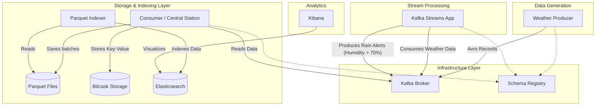

# 🌦️ WeatherStation Data Pipeline

A robust, real-time data streaming pipeline for processing, storing, and analyzing weather station data. 

Built with **Java 21**, **Apache Kafka**, **Kafka Streams**, **Parquet**, **Bitcask**, and the **Elastic Stack**, and designed to be deployed seamlessly on **Kubernetes (Minikube)** or **Docker Compose**.

---

## 🏗️ Architecture

The pipeline consists of several microservices communicating through Kafka, using Avro schemas managed by Confluent Schema Registry.



### Components
1. **Producer (`my_producer`)**: Generates simulated weather data (temperature, humidity, wind) and publishes it to the `weather-stations` Kafka topic.
2. **Stream Processor (`my_stream`)**: Uses Kafka Streams to analyze incoming data in real-time. If humidity exceeds 70%, it generates a warning and publishes to the `rain-alerts` topic.
3. **Central Consumer (`base_central_station`)**: Consumes weather data and performs dual-writes:
   - **Parquet**: Batches data and flushes it to columnar Parquet files for analytics.
   - **Bitcask**: Maintains a high-performance local key-value store for point lookups.
4. **Parquet Indexer (`parquet_es_indexer`)**: Watches the Parquet output directory and automatically indexes new data into Elasticsearch.
5. **Elasticsearch & Kibana**: For searching, aggregations, and dashboard visualization.

---

## 📋 Prerequisites

- **Java 21**
- **Maven**
- **Docker & Docker Compose** (for local testing)
- **Minikube & kubectl** (for Kubernetes deployment)

---

## 🛠️ Building the Project

Compile the project and build the fat JARs for all modules:

```bash
mvn clean package -Dmaven.test.skip=true
```

---

## 🚀 Deployment Options

You can run the entire stack locally using either Docker Compose or Kubernetes.

### Option A: Docker Compose (Local Testing)

```bash
# Start the cluster in the background
docker-compose up -d

# Check the logs of a specific service
docker-compose logs -f stream

# Shut down and clean up volumes
docker-compose down -v
```

### Option B: Kubernetes via Minikube

We provide a complete suite of Kubernetes manifests in the `k8s/` directory. To make deployment effortless, use the provided `k8s/deploy-all.sh` script. This script automatically applies all manifests in the correct order and waits for infrastructure dependencies (like Kafka and Schema Registry) to become healthy before deploying the applications.

1. **Start Minikube** (Ensure you allocate enough resources for Elasticsearch and Kafka):
   ```bash
   minikube start --memory=8192 --cpus=4 --driver=docker
   ```

2. **Point your terminal to Minikube's Docker daemon**:
   ```bash
   eval $(minikube docker-env)
   ```

3. **Build the Docker images directly inside Minikube**:
   ```bash
   docker build -f Dockerfile.producer.minimal -t weather-producer:latest .
   docker build -f Dockerfile.stream.minimal   -t weather-stream:latest .
   docker build -f Dockerfile.consumer.minimal  -t weather-consumer:latest .
   docker build -f DockerFile.indexer           -t weather-indexer:latest .
   ```
   *(Optional: If you have the Elasticsearch and Kibana images locally, you can load them to avoid redownloading: `minikube image load docker.elastic.co/kibana/kibana:8.18.0`)*

4. **Run the One-Click Deployment Script**:
   Use the `deploy-all.sh` script to orchestrate the entire deployment:
   ```bash
   chmod +x k8s/deploy-all.sh
   ./k8s/deploy-all.sh
   ```
   *The script handles creating volumes, config maps, spinning up Kafka/Schema Registry, and gracefully deploying the Producer, Stream Processor, Consumer, and Elastic Stack.*

5. **Access Kibana**:
   Wait for all pods to be `1/1 Running` (`kubectl get pods`), then run:
   ```bash
   minikube service kibana --url
   ```
   Open the provided URL in your browser.

6. **Cleanup**:
   ```bash
   kubectl delete -f k8s/
   ```

---

## 📂 Project Structure

```text
.
├── base_central_station/   # Consumer module (Bitcask & Parquet writer)
├── k8s/                    # Kubernetes manifests and deployment script
├── my_producer/            # Kafka Producer module
├── my_stream/              # Kafka Streams module (Rain alerts)
├── parquet_es_indexer/     # Parquet to Elasticsearch indexer
├── shared_model/           # Shared Avro schemas and models
├── docker-compose.yml      # Local Docker Compose environment
└── pom.xml                 # Root Maven POM
```
