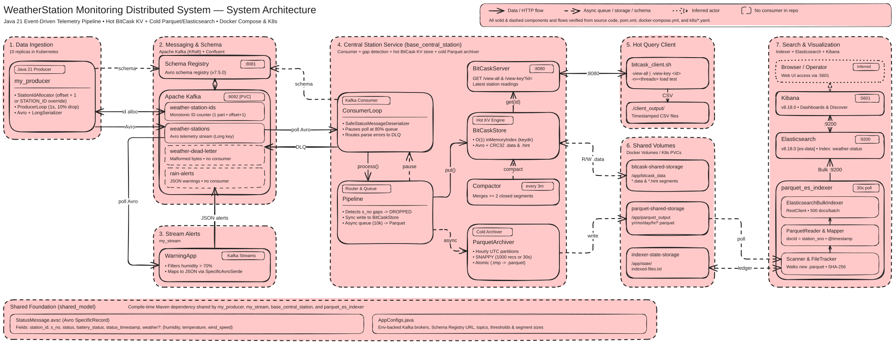

# WeatherStation Monitoring Distributed System

[](https://openjdk.org/)
[](https://kafka.apache.org/)
[](https://kafka.apache.org/documentation/streams/)
[](https://avro.apache.org/)
[](https://www.elastic.co/elasticsearch/)
[](https://www.elastic.co/kibana)
[](https://www.docker.com/)
[](https://kubernetes.io/)

**Simulated weather stations stream Avro telemetry through Apache Kafka into two paths at once: a custom CRC32 BitCask engine for O(1) live state lookups and hourly SNAPPY Parquet archives indexed into Elasticsearch and Kibana.**

Built as a five-module Java 21 Maven platform, the system pairs real-time stream alerting with fault-tolerant storage mechanics: dead-letter routing for malformed payloads, queue-driven consumer backpressure, sequence-gap reconstruction, background segment compaction, and SHA-256 deduplicated search indexing. Runs with one command on Docker Compose or Minikube.

---

## System architecture



### What happens on every reading

1. **Telemetry generation (`my_producer`)**: Each producer picks a random `station_id` (`0..999`) at startup and emits one Avro `StatusMessage` per second to `weather-stations` (with a 10% simulated packet drop), registering schemas with Confluent Schema Registry (`:8081`).
2. **Real-time rain alerting (`my_stream`)**: `WarningApp` consumes `weather-stations` with `SpecificAvroSerde`, filters events where `weather != null` and `humidity > 70%`, serializes structured JSON alerts, and publishes them to `rain-alerts`.
3. **Resilient central ingestion (`base_central_station`)**:
   - **Dead-letter isolation**: `SafeStatusMessageDeserializer` catches deserialization errors and attaches `dlq-error` and `dlq-raw-payload` headers so `ConsumerLoop` routes bad payloads to `weather-dead-letter` instead of crashing polling.
   - **Adaptive backpressure**: When `Pipeline`'s bounded `ArrayBlockingQueue` (`10,000` capacity) hits 80% full, `ConsumerLoop` pauses its assigned Kafka partitions until the queue drains to 50%.
   - **Gap reconstruction**: `Pipeline` tracks `lastSeenSNo` per station and synthesizes `"DROPPED"` markers (`weather = null`) into Parquet history whenever packet sequence gaps appear.
4. **Dual-path storage**:
   - **Hot key-value path (`BitCaskStore` + `BitCaskServer`)**: Appends CRC32-checksummed `DataEntry` records to `.data` segments, keeps an in-memory `ConcurrentHashMap` index for O(1) point reads on port `8080`, writes `.hint` files on roll/shutdown (with CRC32 tail-truncation recovery if a hint file isn't on disk), and compacts closed segments every 3 minutes via `Compactor`.
   - **Cold archive path (`ParquetArchiver`)**: Buffers records per UTC hour (`year=YYYY/month=MM/day=DD/hour=HH`), flushing SNAPPY Parquet files at `1000` records or `30s` using atomic `.tmp -> .parquet` moves.
5. **Search & dashboards (`parquet_es_indexer` -> Elasticsearch -> Kibana)**:
   - `IndexerMain` polls `/app/parquet_output` (`:ro`) every `30s`, tracks processed files by path, mtime, and SHA-256 in `/app/state/indexed-files.txt` so files aren't indexed twice, maps records (`docId = <station_id>_<s_no>`, ISO-8601 `@timestamp`), and bulk-indexes `500` docs per batch into `weather-status` (`:9200`), backing Kibana (`:5601`).

> **Scope notes**: `rain-alerts` and `weather-dead-letter` are produced by services in this repository, though downstream consumers aren't implemented here. `csv-shared-storage` is declared in [docker-compose.yml](./docker-compose.yml) and [k8s/volumes.yaml](./k8s/volumes.yaml), but no container mounts it.

---

## Modules and components

| Module / Component | Stack | Role | Key Files |
| :--- | :--- | :--- | :--- |
| **`shared_model`** | Java 21 / Avro | Shared `StatusMessage.avsc` contract (`SpecificRecord`) and env-backed `AppConfigs` | [StatusMessage.avsc](./shared_model/src/main/resources/avro/StatusMessage.avsc), [AppConfigs.java](./shared_model/src/main/java/com/weather/config/AppConfigs.java) |
| **`my_producer`** | Java 21 / Kafka Client | Simulates weather station readings (1s interval, 10% simulated drops) | [Main.java](./my_producer/src/main/java/com/weather/my_prod/Main.java), [ProducerLoop.java](./my_producer/src/main/java/com/weather/my_prod/ProducerLoop.java) |
| **`my_stream`** | Java 21 / Kafka Streams | Filters `humidity > 70%` and emits JSON alerts to `rain-alerts` | [WarningApp.java](./my_stream/src/main/java/com/weather/my_stream/WarningApp.java) |
| **`base_central_station`** | Java 21 / BitCask + Parquet | Kafka consumer (DLQ + backpressure), gap detector, BitCask KV engine + HTTP `:8080`, Parquet archiver | [Main.java](./base_central_station/src/main/java/com/weather/Main.java), [Pipeline.java](./base_central_station/src/main/java/com/weather/pipeline/Pipeline.java), [BitCaskStore.java](./base_central_station/src/main/java/com/weather/bitcask/engine/BitCaskStore.java), [ParquetArchiver.java](./base_central_station/src/main/java/com/weather/archive/engine/ParquetArchiver.java) |
| **`parquet_es_indexer`** | Java 21 / ES Java Client | Polls Parquet partitions, tracks SHA-256 file ledger, bulk-indexes Elasticsearch | [IndexerMain.java](./parquet_es_indexer/src/main/java/com/weather/indexer/IndexerMain.java), [ElasticsearchBulkIndexer.java](./parquet_es_indexer/src/main/java/com/weather/indexer/ElasticsearchBulkIndexer.java) |
| **`bitcask_client.sh`** | Bash / `curl` | CLI client for BitCask HTTP endpoints (`-view-key`, `-view-all`, `-n=<threads>`) | [bitcask_client.sh](./bitcask_client.sh) |
| **Platform services** | Kafka (KRaft), Schema Registry 7.5.0, Elastic 8.18.0 | Broker (`:9092`), schema registry (`:8081`), search (`:9200`), dashboards (`:5601`) | [docker-compose.yml](./docker-compose.yml), [k8s/](./k8s) |

---

## Telemetry contract

Events conform to [`shared_model/src/main/resources/avro/StatusMessage.avsc`](./shared_model/src/main/resources/avro/StatusMessage.avsc):

```json
{
  "station_id": 104,
  "s_no": 4821,
  "status": "RECEIVED",
  "battery_status": "medium",
  "status_timestamp": 1721643065,
  "weather": {
    "humidity": 82,
    "temperature": 76,
    "wind_speed": 15
  }
}
```

- **Simulated readings (`ProducerLoop`)**: `humidity` `20-100%`, `temperature` `30-110 F`, `wind_speed` `0-50 km/h`, and `battery_status` in `{low, medium, high}`.
- **Synthetic drop records (`Pipeline`)**: `"status": "DROPPED"`, `"battery_status": "unknown"`, and `"weather": null`.

---

## Prerequisites

- **JDK 21** and **Apache Maven 3.8+**
- **Docker Engine** and **Docker Compose**
- **Minikube** and **`kubectl`** (only needed for Kubernetes deployment)
- **Hardware**: **8 GB RAM** and **4 CPU cores** recommended for the full stack

---

## Quickstart

### One-command launch

Docker Compose stack:

```bash
chmod +x start-docker.sh && ./start-docker.sh
```

Minikube / Kubernetes stack (scales `producer` to `10` replicas):

```bash
chmod +x start-k8s.sh && ./start-k8s.sh
```

Search stack only (`parquet-indexer`, `elastic-search`, `kibana`):

```bash
chmod +x start_search_stack.sh && ./start_search_stack.sh
```

### Manual Docker Compose

```bash
# 1. Build shaded JARs across all modules
mvn clean package -Dmaven.test.skip=true

# 2. Start services in detached mode
docker-compose up -d --build

# 3. Inspect status or tail logs
docker-compose ps
docker-compose logs -f consumer stream

# 4. Tear down containers and volumes
docker-compose down -v
```

### Manual Minikube / Kubernetes

```bash
# 1. Start cluster and target Minikube's Docker daemon
minikube start --memory=8192 --cpus=4 --driver=docker
eval $(minikube docker-env)

# 2. Build application images
docker build -f Dockerfile.producer.minimal -t weather-producer:latest .
docker build -f Dockerfile.stream.minimal   -t weather-stream:latest .
docker build -f Dockerfile.consumer.minimal  -t weather-consumer:latest .
docker build -f DockerFile.indexer           -t weather-indexer:latest .

# 3. Apply volumes, ConfigMap, and ordered deployments
chmod +x k8s/deploy-all.sh && ./k8s/deploy-all.sh

# 4. Watch pods and open Kibana
kubectl get pods -w
minikube service kibana --url

# 5. Clean up
kubectl delete -f k8s/
```

---

## Querying live state (BitCask HTTP & CLI)

`BitCaskServer` listens on port `8080` and serves `GET` endpoints directly from the in-memory `ConcurrentHashMap` index (`inMemoryIndex`) and open `.data` `SegmentFile` readers, returning `Content-Type: text/plain; charset=UTF-8` with explicit UTF-8 encoding:

| Request | Status | Response |
| :--- | :--- | :--- |
| `GET /view-key?id=101` (or `?foo=1&id=101`) | `200 OK` | `StatusMessage` string from active, sealed, or compacted segment |
| `GET /view-key?id=99999` (absent key) | `404 Not Found` | `Key Not Found` |
| `GET /view-key`, `/view-key?id=`, `/view-key?id=abc` | `400 Bad Request` | `Missing ID parameter` or `Invalid ID format` |
| `GET /view-all` | `200 OK` | Newline-delimited `key,StatusMessage` lines for all indexed keys |
| Non-`GET` request to either endpoint | `405 Method Not Allowed` | `Method Not Allowed` |

Query parameters are decoded from the raw query string (`&`-delimited pairs split at the first `=`), so extra parameters before or after `id` work and empty/missing values return `400` safely.

```bash
# Latest reading for station 101
curl -s "http://localhost:8080/view-key?id=101"

# Extra parameters in any order work
curl -s "http://localhost:8080/view-key?foo=1&id=101"

# CSV dump (key,StatusMessage) of all stations
curl -s "http://localhost:8080/view-all"
```

Use [`bitcask_client.sh`](./bitcask_client.sh) to query, export timestamped CSVs, or run concurrent load checks (`API_URL` defaults to `http://localhost:8080` locally and `http://consumer:8080` in Compose):

```bash
./bitcask_client.sh -view-key 101
./bitcask_client.sh -view-all
./bitcask_client.sh -n=50
```

---

## BitCask storage engine internals

[`BitCaskStore`](./base_central_station/src/main/java/com/weather/bitcask/engine/BitCaskStore.java), [`SegmentFile`](./base_central_station/src/main/java/com/weather/bitcask/engine/SegmentFile.java), [`HintFile`](./base_central_station/src/main/java/com/weather/bitcask/engine/HintFile.java), and [`Compactor`](./base_central_station/src/main/java/com/weather/bitcask/engine/Compactor.java) implement an append-only log-structured key-value store:

- **Record layout (`SegmentFile`)**: Each entry writes a 24-byte header (`4B CRC32` + `8B timestamp` + `8B key` + `4B valueSize`) followed by the Avro binary `StatusMessage` payload. `readEntry(offset)` and startup recovery verify CRC32 checksums on read.
- **Active segment rotation (`BitCaskStore.put`)**:
  - When `currentOffset >= MAX_SEGMENT_SIZE_KB * 1024`, rotation allocates a strictly monotonic segment ID via `Math.max(Instant.now().toEpochMilli(), currentSegmentId + 1)` so rapid rotations within the same millisecond never collide on `datafile_<id>.data`.
  - The new active `SegmentFile` is opened before sealing the old segment with `closeWriter()`, which flushes and closes only the `DataOutputStream` writer while keeping the `RandomAccessFile` reader open in `segmentFilesById` for `/view-key` and `store.get()` lookups.
  - A `.hint` file (`key`, `segmentId`, `offset`, `valueSize`) is written best-effort in a `try-with-resources` block; if `.hint` creation fails, the error is logged without leaving `activeSegment` null or closed, and startup recovery (`recoverSegmentsWithoutHints()`) rebuilds missing hint files by scanning `.data` records and truncating any torn tail.
- **Compaction (`Compactor.compact`)**:
  - Triggered periodically (`COMPACTION_INTERVAL_MINS`, default `3` min) when at least two closed segments exist.
  - Streams only live records (matching `inMemoryIndex` segment ID and offset) whose CRC32 validates into a new monotonic segment file and writes its `.hint` file.
  - Registers the compacted segment, atomically updates `inMemoryIndex` via `updateIndexIfNewer()` (preserving newer active writes), swaps segment maps via `replaceSegments()`, and then calls `newSegment.closeWriter()` so reads against the compacted segment stay open.
  - Closes old `SegmentFile` handles in `segmentsToCompact` before deleting their `.data` and `.hint` files so file descriptors are not leaked. If compaction aborts or throws before `replaceSegments()`, `newSegment` is closed completely and its uncommitted `.data`/`.hint` files are deleted.

---

## Testing

JUnit 4 unit and HTTP integration tests live in `base_central_station` (and `shared_model`). Because `base_central_station` depends on `com.weather:shared_model:1.0-SNAPSHOT`, install `shared_model` to your local Maven repository first if schema or `AppConfigs` changes haven't been installed yet:

```bash
# Install parent POM and shared_model locally
mvn -pl shared_model -am install

# Run base_central_station test suite
cd base_central_station && mvn test
```

Test coverage in `base_central_station`:
- [`BitCaskStoreTest`](./base_central_station/src/test/java/com/weather/bitcask/engine/BitCaskStoreTest.java): verifies `store.get(key)` reads from sealed segments after sub-millisecond rotations with strictly monotonic segment IDs, rotation resilience when `.hint` file creation fails, `Compactor.compact()` merging multiple closed segments while preserving live reads and disk recovery, and clean abort cleanup when a segment read fails before `replaceSegments()`.
- [`BitCaskServerTest`](./base_central_station/src/test/java/com/weather/bitcask/server/BitCaskServerTest.java): runs an embedded `BitCaskServer` on an ephemeral port and checks `200` responses across active, sealed, and compacted segments (including extra query parameters like `?foo=1&id=101`), `404` for unknown keys, `400` for missing/empty/malformed `id` queries, `405` for non-`GET` methods, `/view-all`, and UTF-8 `Content-Type` headers.

---

## Visualizing history in Kibana

1. Open Kibana at `http://localhost:5601` (or `minikube service kibana --url`).
2. Go to **Stack Management** > **Data Views**.
3. Create a data view for `weather-status*` using `@timestamp` as the timestamp field.
4. Inspect `station_id`, `status` (`RECEIVED` vs `DROPPED`), `temperature`, `humidity`, `wind_speed`, and `battery_status` in **Discover** or **Dashboards**.

---

## Configuration reference

Environment variables read by [AppConfigs.java](./shared_model/src/main/java/com/weather/config/AppConfigs.java) and [IndexerConfig.java](./parquet_es_indexer/src/main/java/com/weather/indexer/IndexerConfig.java):

| Variable | Code Default | Compose / K8s Value | Purpose |
| :--- | :--- | :--- | :--- |
| `KAFKA_BROKER` | `localhost:9092` | `kafka:9092` | Kafka bootstrap servers |
| `SCHEMA_REGISTRY_URL` | `http://schema-registry:8081` | `http://schema-registry:8081` | Confluent Schema Registry URL |
| `KAFKA_PRODUCER_TOPIC` | `weather-stations` | `weather-stations` | Producer target topic |
| `KAFKA_WARNING_INPUT_TOPIC` | `weather-stations` | `weather-stations` | Kafka Streams input topic |
| `KAFKA_WARNING_OUTPUT_TOPIC` | `rain-alerts` | `rain-alerts` | Kafka Streams JSON alert topic |
| `KAFKA_HUMIDITY_THRESHOLD` | `70` | `70` | Rain alert humidity cutoff (%) |
| `KAFKA_CONSUMER_TOPIC` | `weather-stations` | `weather-stations` | Central station input topic |
| `KAFKA_CONSUMER_GROUP_ID` | `base-station-group` | `base-station-group` | Kafka consumer group ID |
| `KAFKA_DEAD_LETTER_TOPIC` | `weather-dead-letter` | `weather-dead-letter` | DLQ topic for deserialization failures |
| `PARQUET_OUTPUT_BASE_PATH` | `/data/parquet_output` | `/app/parquet_output` | Root directory for hourly Parquet output |
| `PARQUET_BATCH_SIZE` | `1000` | `1000` | Records buffered per partition before flush |
| `PARQUET_FLUSH_INTERVAL_SECS` | `30` | `30` | Max batch age and stale-partition sweep interval |
| `BITCASK_STORE_DIRECTORY` | `bitcask_data` | `/app/bitcask_data` | Directory for `.data` and `.hint` files |
| `MAX_SEGMENT_SIZE_KB` | `51200` (50 MB) | `10000` (10 MB) | Active segment rotation threshold |
| `DISK_FLUSH_THRESHOLD` | `1000` | `10000` | Writes before flushing segment stream |
| `HINT_FLUSH_THRESHOLD` | `100` | `20` | Entries before flushing `.hint` stream |
| `COMPACTION_INTERVAL_MINS` | `3` | `3` | Period in minutes for `Compactor` runs |
| `ELASTICSEARCH_URL` | `http://localhost:9200` | `http://elastic-search:9200` | Elasticsearch endpoint for `parquet_es_indexer` |
| `ELASTICSEARCH_INDEX` | `weather-status` | `weather-status` | Target Elasticsearch index |
| `INDEXER_POLL_INTERVAL_SEC` | `30` | `30` | Parquet polling interval (seconds) |
| `INDEXER_STATE_FILE` | `/app/state/indexed-files.txt` | `/app/state/indexed-files.txt` | Persistent ledger of indexed Parquet files |

---

## Repository structure

```text
.
├── base_central_station/         # Consumer, pipeline, BitCask KV + HTTP server, Parquet archiver
│   ├── src/main/java/com/weather/
│   │   ├── Main.java             # Wires store, archiver, pipeline, compactor, API server, consumer
│   │   ├── archive/              # ParquetArchiver, PartitionKey, TimeBucketExtractor
│   │   ├── bitcask/              # BitCaskStore, Compactor, SegmentFile, HintFile, BitCaskServer
│   │   ├── consumer/             # BaseStationConsumer, ConsumerLoop, SafeStatusMessageDeserializer
│   │   └── pipeline/             # Pipeline (gap synthesis, backpressure, async Parquet queue)
│   └── src/test/java/com/weather/bitcask/
│       ├── engine/BitCaskStoreTest.java
│       └── server/BitCaskServerTest.java
├── my_producer/                  # Weather station simulator and Kafka Avro producer
├── my_stream/                    # Kafka Streams humidity > 70% alert processor
├── parquet_es_indexer/           # Parquet scanner, SHA-256 ledger, mapper, Elasticsearch bulk indexer
├── shared_model/                 # StatusMessage.avsc schema and AppConfigs
├── docs/
│   └── system_architecture_ref.svg
├── k8s/                          # Kubernetes deployments, services, PVCs, ConfigMap, deploy-all.sh
├── bitcask_client.sh             # Bash HTTP client for BitCaskServer (:8080)
├── start-docker.sh               # Maven build and Docker Compose launcher
├── start-k8s.sh                  # Minikube image build and K8s deployment launcher
├── start_search_stack.sh         # Starts indexer, Elasticsearch, and Kibana via Docker Compose
├── docker-compose.yml            # Multi-container Compose definition
└── pom.xml                       # Root Maven multi-module POM
```
